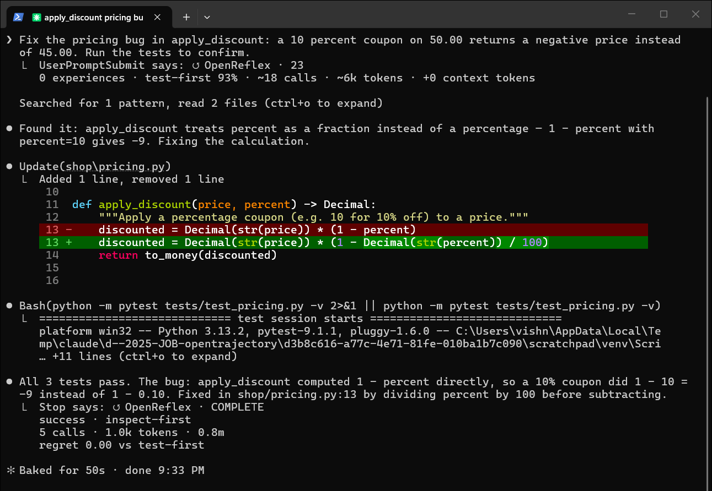
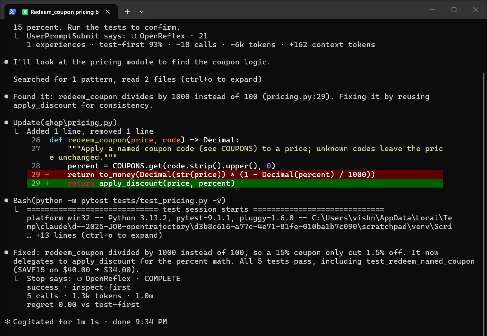
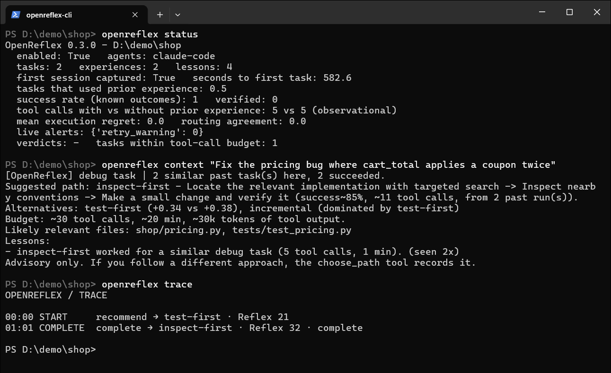

# OpenReflex, end to end: a real Claude Code session, then the next one

Everything below was captured on 2026-09-14 from real, interactive Claude Code sessions (v2.1.270, Sonnet 5) on
Windows 11, with OpenReflex 0.3.0 installed the normal way. The terminal images are unedited window captures with the
empty prompt box cropped off the bottom. The transcript excerpts come from Claude Code's own session logs.

## The project

A small checkout module with a bug. `apply_discount` treats a coupon's percentage as a fraction:

```python
def apply_discount(price, percent) -> Decimal:
    """Apply a percentage coupon (e.g. 10 for 10% off) to a price."""
    discounted = Decimal(str(price)) * (1 - percent)   # 10 percent off 50.00 gives -450.00
    return to_money(discounted)
```

```
$ python -m pytest -q
FAILED tests/test_pricing.py::test_ten_percent_off - AssertionError: assert D...
FAILED tests/test_pricing.py::test_cart_total_applies_coupon_once - Assertion...
2 failed, 1 passed in 0.27s
```

## Connect OpenReflex

```
$ pipx install openreflex
$ openreflex install claude-code
OPENREFLEX / CONNECT
  agent       claude-code
  project     D:\demo\shop
  config      updated 2 files
              D:\demo\shop\.claude\settings.json
              D:\demo\shop\.mcp.json
  memory      enabled
  storage     local

  [ok] reflex active
```

That writes Claude Code hooks and the MCP server entry for this project. Nothing else changes: you open Claude Code
and work as usual.

## Session 1: the first time OpenReflex sees this kind of task



The prompt was:

> Fix the pricing bug in apply_discount: a 10 percent coupon on 50.00 returns a negative price instead of 45.00. Run
> the tests to confirm.

The first thing in the transcript is OpenReflex's start recap, delivered through the `UserPromptSubmit` hook:

```
↺ OpenReflex · 23
0 experiences · working approach · 93% · ~18 calls · ~6k tokens · +0 context tokens
```

Read it as: this project has no experience with similar tasks yet, so the plan is the default prior (estimated 93%
success, about 18 tool calls). `+0 context tokens` means nothing was injected into the model's context.
OpenReflex never adds context it does not have evidence for. The number 23 is the Reflex Score, how strong the
recommendation is; with no evidence it is low.

Claude then did what it normally does: `Grep` for `apply_discount`, `Read` the module and the tests, one `Edit`, and
`python -m pytest`. Five tool calls, 50 seconds. When the turn ended, the `Stop` hook reported:

```
↺ OpenReflex · COMPLETE
```

The completion surface stays that compact on purpose. Behind it, three things happened:

- The outcome is `success` because a test run passed after the last edit. OpenReflex infers outcomes only from
  checks that actually ran; without one, the outcome would stay `unknown` and nothing would be learned.
- The path taken was inferred as `inspect-first` (search, read, edit, verify), not the default `test-first`.
- The path comparison was recorded as evidence, not shown: `openreflex status` and `openreflex trace` report it, and
  OpenReflex does not claim an alternative was better without comparable completed-task evidence.

What was stored for this task, from the local database:

```
status: success | strategy: inspect-first | calls: 5 | files: ['shop/pricing.py', 'tests/test_pricing.py']
tools: Grep (search) → Read (read) → Read (read) → Edit (edit) → Bash (test)
lesson: Changes for this kind of task landed in: shop/pricing.py.
lesson: inspect-first worked for a similar debug task (5 tool calls, 1 min).
```

No file contents, no command text, no tool output and no conversation were stored.

## Between the sessions

The fix was committed. A teammate then landed named coupon codes, with a bug (`/ 1000` instead of `/ 100`) and a
failing test:

```
7a9a0e2 Add named coupon codes
9f2c5d8 Fix percent scaling in apply_discount
```

## Session 2: a similar task, a new Claude Code session



The prompt was:

> Fix the pricing bug in redeem_coupon: the SAVE15 coupon takes 1.5 percent off a 40.00 item instead of 15 percent.
> Run the tests to confirm.

This time the start recap says something different:

```
↺ OpenReflex · 21
1 experiences · working approach · 82% · ~12 calls · ~4k tokens · +94 context tokens
```

One similar past task was found, and 94 tokens of context were injected before Claude's first tool call. This is
the exact text the model received (from Claude Code's session log):

```
[OpenReflex] BUILD · debug | 1 similar past task(s) here, 1 succeeded.
Working approach: Locate the relevant implementation with targeted search -> Inspect nearby conventions -> Make a small change and verify it
Budget: ~30 tool calls, ~20 min, ~30k tokens of tool output.
Likely relevant files: shop/pricing.py, tests/test_pricing.py
Advisory; choose_path records deviations.
```

Claude's first words were "I'll look at the pricing module to find the coupon logic." It went to `shop/pricing.py`
and `tests/test_pricing.py`, the two files the context named, made one edit and ran the tests. Five tool calls, one
minute, all five tests passing, and a completion recap:

```
↺ OpenReflex · COMPLETE
```

An honest reading of this pair: in a three-file repository there is not much for a well-behaved agent to save, and
both sessions took five calls. What the second session shows is the mechanism working end to end: the first task was
recorded with a verified outcome, the second task retrieved it, the model received the files and the approach that
worked before it did anything, and the new outcome was recorded the same way. The working approach already follows what
worked (locate, inspect, change, verify) and the budget tightened from about 45 tool calls to about 30, but the
success estimate is deliberately modest after one run.

## Ask OpenReflex what it knows



```
$ openreflex status
OpenReflex 0.3.0 - D:\demo\shop
  enabled: True   agents: claude-code
  tasks: 2   experiences: 2   lessons: 4
  first session captured: True   seconds to first task: 582.6
  tasks that used prior experience: 0.5
  success rate (known outcomes): 1   verified: 0
  tool calls with vs without prior experience: 5 vs 5 (observational)
  path checks: 0   routing agreement: 0.0
  live alerts: {'retry_warning': 0}
  verdicts: -   tasks within tool-call budget: 1
```

`verified: 0` because neither session called `record_outcome`; both outcomes were inferred from the test runs.
`routing agreement: 0.0` because the suggested path was `test-first` and both runs turned out `inspect-first`.
OpenReflex reports that plainly rather than hiding it.

```
$ openreflex why
OPENREFLEX / WHY

Recommendation  inspect-first
REFLEX          32/100
SUCCESS         82%
CONFIDENCE      29%

SIGNALS
  budget fit       100%
  relevance        62%
  confidence       29%
  evidence         12%
  route advantage  0%

Next best        test-first
Route advantage  0%

Policy           1.0
```

```
$ openreflex trace
OPENREFLEX / TRACE

00:00 START     recommend → test-first · Reflex 21
01:01 COMPLETE  complete → inspect-first · Reflex 32 · complete
```

And a preview of what a third, similar task would receive, without recording anything:

```
$ openreflex context "Fix the pricing bug where cart_total applies a coupon twice"
[OpenReflex] BUILD · debug | 2 similar past task(s) here, 2 succeeded.
Working approach: Locate the relevant implementation with targeted search -> Inspect nearby conventions -> Make a small change and verify it
Budget: ~30 tool calls, ~20 min, ~30k tokens of tool output.
Likely relevant files: shop/pricing.py, tests/test_pricing.py
Advisory; choose_path records deviations.
```

After two verified runs the working approach is the one that actually worked here (locate, inspect, change, verify)
rather than the default reproduce-first prior, and the budget has tightened from about 45 tool calls to about 30.
That is the feedback loop: what actually worked in this project now outranks the prior.

The opposite case matters too. Once a project has at least five recorded tasks, a prompt with no similar past work
is flagged instead of silently getting an empty context:

```
[OpenReflex] BUILD · refactor | Novel task for this project: no similar past work. Explore before editing; budget widened.
```

The budget for a novel task is widened (1.5x by default, never past a limit you set), so the over-budget alerts at
100%, 150% and 200% of the budget do not fire just because unfamiliar work takes longer.

## What was never stored

Per tool call OpenReflex keeps the tool name, a coarse category, a fingerprint of the arguments, project-relative file
paths, pass or fail, duration, output size and a masked one-line error signature. It does not keep file contents,
command text, tool output, transcripts or paths outside the project. The prompt is kept as a task description with
secrets redacted. Everything lives in one SQLite file under `~/.openreflex/`, and `openreflex forget --yes` deletes it.

## Reproduce it

1. `pipx install openreflex`, then in any git repository: `openreflex install claude-code`.
2. Open Claude Code in that repository and give it a real task that ends with a test, lint or build.
3. Give it a similar task in a new session. The `UserPromptSubmit` line will show how many past experiences were
   found and how many context tokens were added.
4. `openreflex status`, `openreflex why`, `openreflex trace`, and `openreflex context "<task>"` show what was learned.

The demo repository is three files (`shop/pricing.py`, `tests/test_pricing.py`, `conftest.py`) and the two prompts
above; the bug in session 1 is `(1 - percent)` where `(1 - Decimal(str(percent)) / 100)` was meant, and the bug in
session 2 is `/ 1000` where `/ 100` was meant.
